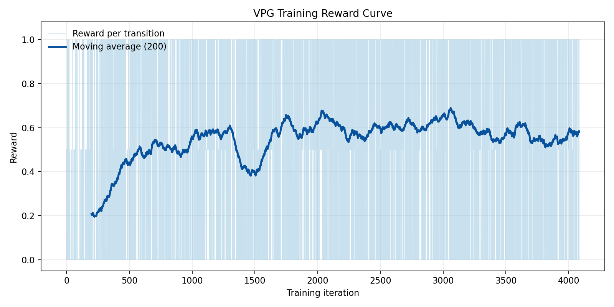
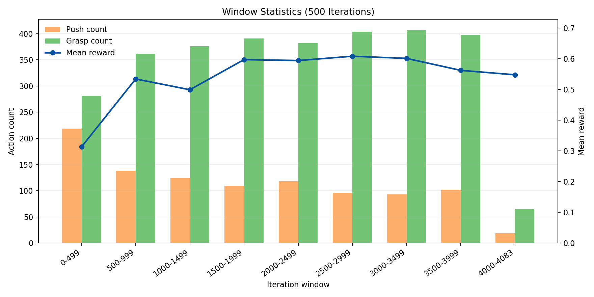
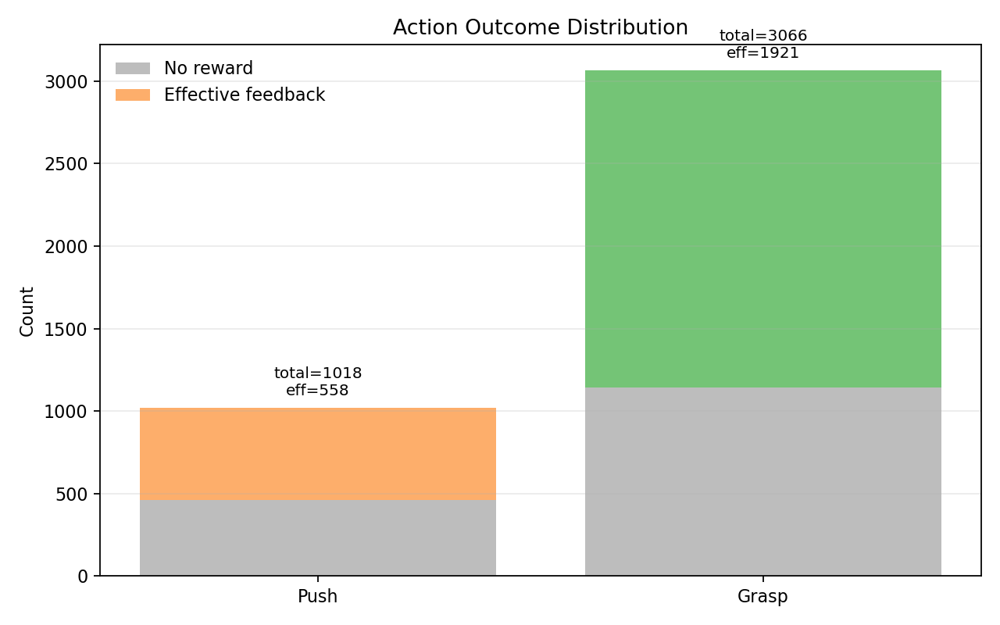
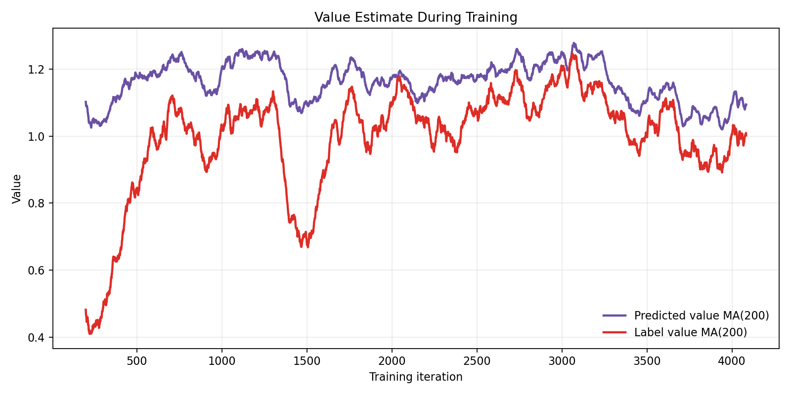

# 基于 VPG 与视觉伺服融合的机械臂抓取与推动仿真系统结题报告

## 摘要

机器人在非结构化场景中完成抓取与推动任务时，需要同时解决环境感知、动作决策、末端执行器对准以及运动执行等问题。单纯依靠规则控制方法往往难以处理堆叠、遮挡和物体姿态变化，而纯学习方法在实际执行时又容易受到相机标定误差、深度噪声和机械臂运动误差的影响。针对这一问题，本项目在已有 SAPIEN 机械臂仿真平台的基础上，实现了 VPG 强化学习策略与视觉伺服控制相结合的机械臂抓取与推动仿真系统。

系统以 Franka Panda 机械臂为执行平台，使用腕部 RGB-D 相机获取当前场景图像，将 RGB-D 数据转换为 VPG 所需的 heightmap 表示，并通过 VPG 模型输出动作类型、目标位置和动作角度。在执行阶段，系统引入基于 RGB-D 投影误差的视觉伺服方法，对 VPG 给出的目标点进行小范围 XY 修正，再通过 SAPIEN 与 mplib 完成抓取或推动 primitive 的运动规划与执行。该融合方案形成了从感知、决策、局部修正到动作执行的闭环流程，提高了系统结构的完整性和可扩展性。

本项目完成了 VPG 推理接口封装、腕部 RGB-D 相机适配、heightmap 构建、视觉伺服误差估计、抓取/推动 primitive 执行以及 SAPIEN 训练环境适配等工作。通过单轮和多轮闭环验证，系统能够完成 RGB-D 采集、VPG 动作预测、可选视觉伺服修正、primitive 执行和回到观察位的完整流程，为后续开展定量实验、真实机械臂迁移和自监督训练提供了基础。

**关键词**：机械臂抓取；视觉伺服；VPG；SAPIEN；RGB-D；强化学习；运动规划

## 1. 引言

机械臂抓取与推动是机器人操作任务中的基础问题。在真实或仿真环境中，机械臂不仅需要判断应该抓取哪个物体，还需要确定合适的抓取位置、接近方向和执行轨迹。当场景中存在多个物体、物体之间发生遮挡或堆叠时，单一的抓取动作可能无法直接完成目标操作，推动动作也常被用于改变物体布局，为后续抓取创造条件。因此，将推动和抓取统一到同一决策框架中，是提升机器人操作能力的重要方向。

传统基于规则的方法通常依赖人工设计的几何特征、物体模型或精确位姿估计。这类方法在结构化环境中较为有效，但面对未知物体、复杂堆叠和感知噪声时适应性有限。相比之下，基于视觉输入的学习方法可以直接从图像或高度图中学习动作价值。VPG，即 Visual Pushing and Grasping，是一种典型的视觉推动与抓取强化学习方法。它以 RGB-D 图像生成的 heightmap 为输入，预测不同旋转角度下执行 push 或 grasp 的动作价值，从而选择当前场景中最合适的操作。

然而，学习策略给出的动作点并不等价于执行阶段的绝对精确控制。模型推理、相机坐标变换、机械臂运动规划和仿真物理接触都会引入误差。如果直接将学习策略输出的目标点交给机械臂执行，可能出现末端执行器与目标物体未完全对准的情况。视觉伺服方法可以利用执行前的相机观测，对目标点和夹爪作用点之间的图像误差进行补偿，从而提高执行阶段的鲁棒性。

本项目的核心思想是将 VPG 的高层动作决策能力与视觉伺服的局部对准能力结合起来：VPG 决定做什么、在哪里做、以什么角度做；视觉伺服负责判断执行前是否对准，并对目标点进行小范围修正；底层机械臂控制模块负责将动作转化为 SAPIEN 仿真中的关节运动。通过这种分层设计，系统既保留了学习策略处理复杂场景的能力，又增强了动作执行前的几何一致性。

## 2. 系统总体设计

本系统采用分层控制架构，主要由感知层、决策层、视觉伺服层和执行层组成。感知层通过安装在 Panda 末端的腕部 RGB-D 相机采集场景信息；决策层将 RGB-D 图像转换为 heightmap 后输入 VPG 模型，得到当前应执行的 primitive；视觉伺服层在执行前根据目标点投影误差计算局部修正量；执行层调用 mplib 进行机械臂运动规划，并在 SAPIEN 中完成抓取或推动动作。

整体流程如下：

```text
Panda 回到固定观察位
-> 腕部 RGB-D 相机采集图像
-> RGB-D 转换为 VPG heightmap
-> VPG 输出 action、target_xyz、theta
-> 机械臂移动到目标点上方
-> 可选视觉伺服计算 XY 修正
-> 执行 grasp 或 push primitive
-> 回到观察位进入下一轮
```

系统默认观察位为 `Pose([0.40, 0.10, 0.50], [0, 1, 0, 0])`，该位置能够让腕部相机从上方观察工作空间内的物体。工作空间范围设置为 `[[0.176, 0.624], [-0.224, 0.224], [0.0, 0.4]]`，对应 Panda 前方适合推动和抓取的区域。heightmap 分辨率为 `0.002 m/pixel`，在默认工作空间下生成约 `224 x 224` 的颜色高度图和深度高度图。

系统的决策和执行边界较为明确。VPG 模型只负责输出动作语义，包括 `push` 或 `grasp`、目标点 `target_xyz`、动作角度 `theta` 和预测置信度。视觉伺服只允许对目标点的 XY 坐标进行小范围修正，最大修正量限制为 `0.02 m`，不改变动作类型、动作角度、push 方向或 push 长度。执行层则根据修正后的目标点生成具体的运动轨迹，例如抓取时张开夹爪、下探、闭合、抬升，推动时闭合夹爪、下降、沿指定方向直线推动并抬升。

这种分层方式使系统具备较好的可维护性。VPG 模型可以替换为重新训练后的权重，视觉伺服模块可以进一步接入真实机器人标定结果，底层运动执行也可以根据不同机械臂模型调整，而不需要整体重写控制流程。

## 3. 关键模块实现

### 3.1 SAPIEN 仿真与 Panda 运动控制

项目使用 SAPIEN 作为仿真平台，使用 Franka Panda 作为主要机械臂模型。`Controller` 模块负责创建仿真场景、添加地面、设置光照、创建 viewer 和录像相机，并通过 URDF 加载机器人或物体。机器人配置集中放在 `src/config/robot_varant.py` 中，Panda 配置包含 URDF 路径、SRDF 路径、末端执行 link 名称和初始位姿。

运动规划由 `MotionPlanning` 模块封装，内部使用 mplib 创建规划器。系统主要通过 `move_to_pose()` 接口将末端执行器移动到目标位姿。该接口优先尝试 screw motion 规划，如果失败则回退到 RRTConnect 规划，从而在保证执行效率的同时提高规划成功的可能性。夹爪控制通过设置末端两个夹爪关节的 drive target 实现，系统提供 `open_gripper()` 和 `close_gripper()` 两个高层接口。

为了降低初始碰撞和关节状态不稳定对后续任务的影响，系统在启动时会将 Panda 设置到安全初始位，并让物理引擎空跑若干步，使机械臂和场景进入稳定状态。随后系统会在工作空间内随机生成多个彩色几何物体，默认数量为 `8`，用于构造简单的 clutter 场景。

### 3.2 腕部 RGB-D 相机与坐标转换

融合系统使用安装在 Panda 末端 `panda_hand` 上的腕部 RGB-D 相机进行观察。默认相机外参为 `sapien.Pose([0.05, 0.0, 0.04], [0.7071, 0, -0.7071, 0])`，表示相机相对于夹爪末端的安装位置和姿态。系统通过 `create_wrist_rgbd_camera()` 创建相机，并通过 `capture_rgbd()` 获取颜色图、深度图和相机内参矩阵。

由于 SAPIEN 相机坐标系和 VPG 原始实现使用的相机坐标系不同，系统实现了坐标转换函数，将 SAPIEN 中的相机位姿转换为 VPG 所需的 camera-to-world 矩阵。VPG 侧通常使用 `x=right, y=down, z=forward` 的针孔相机坐标，而 SAPIEN 挂载相机使用的局部方向与之不同。因此，系统在构建 heightmap 和视觉伺服投影时都需要进行一致的坐标变换，保证 RGB-D 点云能够正确落入世界坐标系下的工作空间。

深度图读取时，系统兼容 SAPIEN 不同版本的图像接口，优先读取 `Position` 或 `Depth` 图像，并从候选通道中选择有效深度最多的结果。这一处理提高了模块在不同渲染接口下的适配能力。

### 3.3 RGB-D 到 Heightmap 的转换

VPG 模型的输入不是原始相机图像，而是从固定工作空间投影得到的 heightmap。系统首先根据相机内参将深度图反投影为相机坐标系下的三维点云，再利用相机外参将点云转换到世界坐标系。随后根据工作空间边界裁剪点云，并按照 heightmap 分辨率将点云投影到二维栅格中。

颜色 heightmap 保存每个栅格对应的 RGB 信息，深度 heightmap 保存该位置相对于工作空间底面的高度。无效深度会被置零或标记为无效，避免影响 VPG 模型的输入。系统优先复用原始 VPG 项目中的 `utils.get_heightmap()`，当原始工具模块不可用时，也提供了本地 heightmap 构建实现。这种设计既保证了与原 VPG 数据处理流程的一致性，也增强了当前项目的独立运行能力。

heightmap 的作用是将三维操作问题转化为二维图像上的动作选择问题。VPG 网络可以在不同旋转角度下输出 push 和 grasp 的动作价值图，系统再将最佳像素位置反算为世界坐标下的目标点 `target_xyz`。

### 3.4 VPG 推理封装

项目中的 `VPGPolicy` 模块负责封装原始 VPG 项目的推理逻辑。系统将 `visual-pushing-grasping-master` 加入 Python 模块搜索路径，复用其中的 `trainer.py`、`models.py` 和相关网络结构。默认模型权重路径为 `visual-pushing-grasping-master/downloads/vpg-original-sim-pretrained-10-obj.pth`。如果权重文件不存在，程序会给出明确提示，要求先下载预训练权重。

原 VPG 模型会为 push 和 grasp 分别输出多角度动作价值图。系统比较两类动作中的最大预测值，选择置信度更高的动作作为当前 primitive。最佳像素索引中的旋转维度被转换为动作角度 `theta`，像素坐标则结合 heightmap 分辨率和工作空间边界转换为世界坐标 `target_xyz`。

为了适配离线环境，系统还对 torchvision 的 DenseNet121 加载逻辑进行了补丁处理，避免在只进行 snapshot 加载时额外下载 ImageNet 权重。这样更符合实验室或课程项目中常见的离线运行场景。

### 3.5 视觉伺服局部修正

视觉伺服模块的目标不是重新寻找物体中心，也不是替代 VPG 重新决策，而是在执行前对 VPG 给出的目标点进行几何一致性检查和小范围修正。系统先将机械臂移动到 VPG 目标点上方，然后重新采集腕部 RGB-D 图像。接着根据当前末端位姿、手眼外参和相机内参，将 `target_xyz` 投影到当前相机图像中，得到 `target_pixel`。

视觉伺服将 `target_pixel` 与夹爪作用点标定像素 `desired_gripper_pixel` 进行比较。若未显式设置标定像素，系统会根据当前末端位姿构造默认作用点。像素误差结合目标像素处的深度值和相机内参，被反投影为相机坐标系中的小位移，再转换到世界坐标系下得到 `delta_xy`。

为了避免错误观测造成过大修正，系统设置了多种保护条件：当目标点在相机后方、投影越界、目标像素深度无效、相机内参异常或修正量超过 `0.02 m` 时，视觉伺服返回零修正并记录状态。只有当状态正常且修正量有效时，机械臂才会移动到修正后的目标点上方。

该设计使视觉伺服成为一个受限的局部补偿模块。它提高了执行前对准的鲁棒性，同时不会破坏 VPG 输出的动作语义。

### 3.6 Grasp 与 Push Primitive 执行

系统将 VPG 输出统一转化为两类 primitive：`grasp` 和 `push`。两类动作共享目标对准阶段，即先根据 `target_xyz` 和 `theta` 移动到安全高度，再根据配置决定是否启用视觉伺服修正。

对于抓取动作，系统首先打开夹爪，然后移动到修正后目标点的抓取高度，默认 `grasp_z` 为 `0.125 m`。随后关闭夹爪并抬升到安全高度。系统通过夹爪关节开合程度估计是否有物体阻挡夹爪，从而得到一个定性的 `grasp_success` 判断。当配置启用 `place_after_grasp` 时，系统会在抓取后将物体移动到预设丢放位置并打开夹爪。

对于推动动作，系统会闭合夹爪，将末端移动到推动高度，默认 `push_z` 为 `0.10 m`，再沿 VPG 输出角度 `theta` 的方向直线推动。默认推动长度为 `0.10 m`。推动终点会被裁剪到工作空间范围内，防止规划目标超出有效区域。推动完成后，机械臂抬升回安全高度。

通过 primitive 封装，系统将高层 VPG 输出与底层运动控制解耦，使后续扩展新的动作类型或调整执行参数更加方便。

## 4. VPG 训练环境适配

除推理闭环外，项目还实现了 SAPIEN 环境下的 VPG 训练入口。训练模块的目标是在尽量保持原始 VPG 学习逻辑不变的情况下，将原项目中的 UR5 + V-REP/CoppeliaSim 环境替换为 Panda + SAPIEN 环境。

训练流程包括：Panda 回到固定观察位，腕部 RGB-D 相机采集图像，RGB-D 转换为 heightmap，VPG 网络输出 push/grasp Q map，根据原始 VPG 策略选择动作、像素和角度，Panda 执行动作，再次观察场景，根据抓取是否成功或场景是否变化计算 reward 和 label，最后进行反向传播并保存日志和模型权重。

训练入口复用原项目中的 `Trainer`、`Logger`、`models` 和 `utils`，保持了原始方法中的多项关键设置，包括 `num_rotations = 16`、`heightmap_resolution = 0.002`、`future_reward_discount = 0.5`、探索策略、经验回放和日志格式等。不同之处主要在于仿真、相机和 primitive 执行环境已经被替换为本项目的 SAPIEN/Panda 实现。

需要注意的是，当前设计中训练期间不使用视觉伺服。视觉伺服主要用于推理阶段或后续真实机器人部署时的执行补偿。这一选择可以避免训练数据分布被伺服修正过程影响，使训练逻辑更接近原始 VPG 方法。

## 5. 实验与训练结果分析

本节基于 `logs/2026-04-30.00-08-34` 中保存的训练日志，对 VPG 在 SAPIEN/Panda 环境中的训练效果进行分析。该训练会话记录了 `4085` 次动作执行，其中 reward 与 label 记录各 `4084` 条。最后一个动作尚未对应下一轮状态反馈，因此 reward 数量比动作数量少 1。日志中还保存了 RGB-D 图像、heightmap、动作选择、reward、label value、predicted value、exploit 标记和 clearance 记录，能够较完整地反映训练过程。

从整体 reward 分布看，训练过程中 `reward=1.0` 共出现 `1921` 次，`reward=0.5` 共出现 `558` 次，`reward=0.0` 共出现 `1605` 次，全局平均 reward 为 `0.5387`。其中 `1.0` 主要对应抓取成功反馈，`0.5` 主要对应推动后造成场景变化的反馈，`0.0` 表示动作没有获得有效收益。按 500 次迭代窗口统计，前 500 次平均 reward 仅为 `0.313`，随后提升到 `0.534`，中期在 `0.59-0.61` 附近波动，后期保持在约 `0.55-0.56`。这说明训练早期模型策略较不稳定，随着训练推进，网络逐渐获得了有效的动作价值估计。



图中可以看到，单步 reward 本身波动较大，这是强化学习训练中的正常现象；但 200 次滑动平均曲线从早期较低水平逐步上升，并在中后期保持在明显高于初始阶段的位置。该趋势说明当前 SAPIEN/Panda 训练环境能够为 VPG 模型提供有效学习信号，reward 计算、动作执行和网络更新链路是可用的。

动作选择方面，训练共执行 push `1018` 次、grasp `3067` 次，grasp 占比约 `75.1%`。分窗口观察可以发现，训练初期 push 数量相对较多，后期 grasp 数量占比逐渐提高。这表明模型在当前 clutter 场景中逐渐倾向于选择预期收益更高的抓取动作。



按动作类型进一步分析，grasp 的平均 reward 为 `0.6265`，其中 `reward=1.0` 出现 `1921` 次，`reward=0.0` 出现 `1145` 次。push 的平均 reward 为 `0.2741`，其中 `reward=0.5` 出现 `558` 次，`reward=0.0` 出现 `460` 次。由于 push 的有效反馈上限为 `0.5`，因此约 `54.8%` 的 push 动作产生了有效场景变化。相比之下，grasp 的收益更高，也解释了训练后期策略更偏向抓取。



价值估计方面，predicted value 与 label value 的滑动平均曲线在训练中均出现明显变化。label value 从初期较低水平上升到中期较高水平，说明随着训练推进，动作执行后的监督目标整体变好。predicted value 在训练中保持较高水平并随 label value 波动，说明网络已经开始形成对动作价值的估计，但两条曲线仍存在一定间隔和波动，表明模型尚未完全收敛。



策略选择方面，整体 exploit 比例约为 `65.5%`，最后 500 次提升到约 `76.2%`，说明训练后期模型更多依赖网络预测的动作价值进行选择，而不是随机探索。heuristic 使用率为 `0%`，说明本次训练中的动作主要由探索-利用策略和网络输出决定，没有依赖启发式动作修正。

综合来看，本次训练结果表明，VPG 模型在当前 SAPIEN/Panda 环境中获得了有效训练效果。模型从初期低 reward 阶段逐渐提升到中期较稳定状态，grasp 能力提升较明显，push 也能在超过一半的执行中造成有效场景变化。不过 reward 后期仍有一定波动，push 收益低于 grasp，说明模型具备初步可用性，但仍需要进一步训练和更系统的测试评估。

## 6. 项目成果与创新点

本项目的主要成果包括以下几个方面。

第一，完成了 VPG 与 SAPIEN/Panda 环境的工程融合。原始 VPG 项目依赖 UR5 与 V-REP/CoppeliaSim 环境，而本项目将其推理和训练逻辑迁移到基于 SAPIEN 的 Panda 仿真平台中，使系统更符合当前项目已有的仿真框架。

第二，实现了腕部 RGB-D 相机到 VPG heightmap 的完整数据通路。系统能够从 Panda 末端相机采集 RGB-D 图像，并通过坐标转换和点云投影构建 VPG 所需的 heightmap 表示，解决了学习模型输入与仿真观测之间的衔接问题。

第三，设计了受限视觉伺服补偿机制。视觉伺服模块只对 VPG 目标点进行小范围 XY 修正，不改变动作类型和动作方向，既保留了学习策略的决策结果，又提高了执行前目标对准的可靠性。

第四，封装了统一的 push/grasp primitive 执行接口。系统能够根据 VPG 输出自动选择抓取或推动动作，并通过 mplib 完成运动规划和轨迹执行。这种封装降低了高层策略与底层控制之间的耦合度。

第五，完成了 SAPIEN/Panda 环境中的 VPG 训练链路验证。训练日志表明，系统不仅能够执行推理闭环，还能够在仿真环境中完成动作采样、reward 计算、label 生成、反向传播、日志保存和模型权重保存。平均 reward 从训练初期的 `0.313` 提升到中后期约 `0.56-0.61`，说明训练环境能够产生有效学习信号，模型已经具备初步推动-抓取决策能力。

第六，形成了可视化的训练结果分析方法。通过 reward 曲线、窗口统计、动作反馈分布和价值估计曲线，可以直观展示模型训练过程中的性能变化。这些图表不仅服务于本次结题报告，也为后续调参、比较不同训练策略和分析失败原因提供了依据。

## 7. 局限性分析

当前系统仍存在一些不足。

首先，模型尚未完全收敛。虽然平均 reward 相比训练初期有明显提升，但中后期仍存在波动，并且最后阶段没有继续保持在最高水平。这说明当前训练已经有效，但仍需要更长时间训练、更多随机场景和更稳定的超参数设置来提升收敛质量。

其次，push 动作收益低于 grasp。训练中 push 平均 reward 为 `0.2741`，grasp 平均 reward 为 `0.6265`，模型后期也更倾向于选择 grasp。虽然约 `54.8%` 的 push 产生了有效场景变化，但推动动作的学习效果仍弱于抓取。后续需要增加更适合推动的 clutter 场景，或进一步优化 push reward 与场景变化判定。

第三，clearance 触发较频繁。日志中 clearance 记录为 `302` 次，平均约每 `13.4` 次迭代发生一次。这可能与场景中物体被清空、连续动作未造成有效变化或环境重置条件较敏感有关。当前日志只记录 clearance 发生的迭代编号，还不能区分具体原因，因此后续应补充 clearance 原因记录。

第四，视觉伺服目前只做局部 XY 修正，且最大修正量限制为 `0.02 m`。这种设计较为安全，但无法处理 VPG 目标点本身明显错误、物体被严重遮挡或目标深度不可靠的情况。视觉伺服也没有重新估计物体中心或接触几何，因此它只是执行补偿模块，而不是完整的重定位模块。

第五，系统仍主要运行在仿真环境中。真实机械臂部署时还需要解决手眼标定、相机畸变、深度噪声、机械臂控制延迟、夹爪摩擦和物体材质差异等问题。仿真中可直接获得稳定 RGB-D 数据和理想关节控制，但真实系统往往会面临更多不确定性。

第六，异常恢复机制还可以进一步完善。当前系统能够在部分规划失败或伺服异常时回退或拒绝修正，但对于连续失败、物体飞出工作空间、夹爪误抓、仿真不稳定等复杂情况，还需要更系统的状态机和恢复策略。

## 8. 总结与展望

本项目围绕机械臂抓取与推动任务，完成了 VPG 强化学习策略与视觉伺服控制在 SAPIEN/Panda 仿真平台中的融合实现。系统通过腕部 RGB-D 相机获取场景观测，将 RGB-D 数据转换为 VPG heightmap，由 VPG 模型输出动作类型、目标点和动作角度，再通过视觉伺服对执行前的对准误差进行局部修正，最终使用 mplib 规划并执行抓取或推动 primitive。该流程形成了较完整的“感知-决策-修正-执行”闭环。

训练数据进一步验证了该系统的有效性。模型在 4000 余次动作记录中获得了明显的 reward 提升：初期平均 reward 较低，中期提升并稳定在较高区间；grasp 动作获得了较好的成功反馈，push 动作也能在超过一半的执行中产生有效场景变化。exploit 比例在训练后期上升，说明网络预测开始主导动作选择。总体来看，当前模型已经具备初步可用的推动-抓取决策能力，但仍未达到完全收敛状态。

与原始单一视觉伺服 demo 相比，融合系统具备处理多物体 clutter 场景的高层决策能力；与单独的 VPG 推理相比，系统增加了执行前的局部视觉补偿，使动作落点更符合当前末端相机观测。项目还保留了 SAPIEN 环境下的 VPG 训练入口，并通过本次训练日志证明了训练链路的可运行性。

未来工作可以从五个方向继续推进。第一，延长训练轮数并增加独立测试场景，使用固定测试集评估模型泛化能力。第二，补充更多训练曲线和评估指标，例如不同物体数量下的 reward、grasp 反馈、push 有效变化率和 clearance 原因统计。第三，针对 push 收益较低的问题，设计更强调遮挡解除和场景重排的训练场景。第四，对比 `--use-servo` 与 `--no-servo` 在最终执行中的效果，量化视觉伺服对动作落点和执行成功反馈的影响。第五，面向真实机械臂部署补充手眼标定、相机畸变校正、控制延迟补偿和安全异常恢复机制。

总体而言，本项目完成了从已有仿真平台到学习式推动抓取系统的关键集成工作，并通过训练日志和图表验证了 VPG 在 SAPIEN/Panda 环境中的有效学习趋势。该系统为后续课程实验、算法改进和真实机器人迁移提供了一个结构清晰、模块边界明确且具备训练能力的基础平台。
