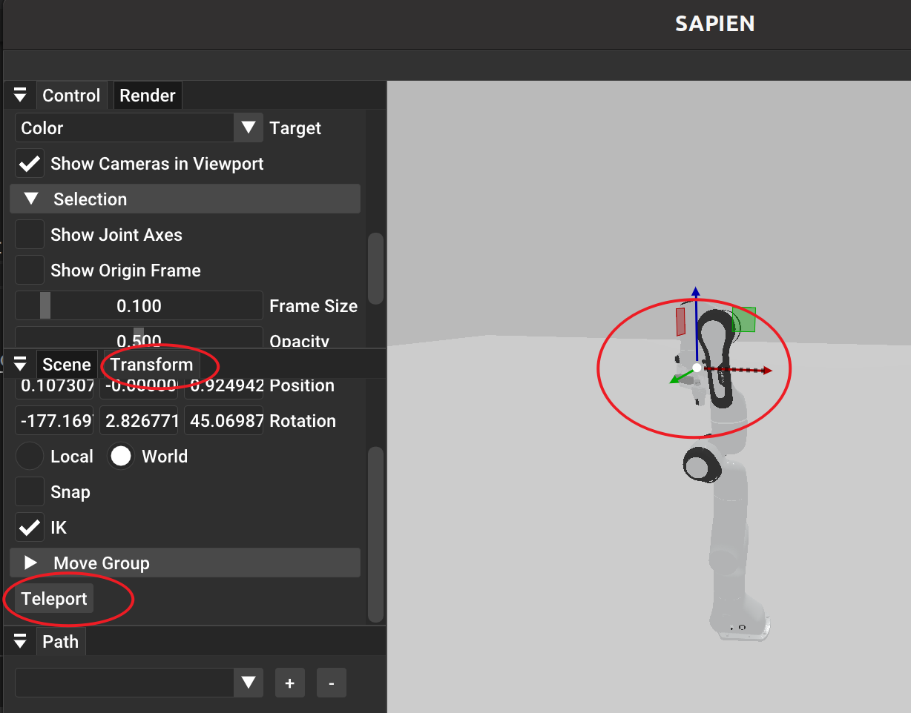
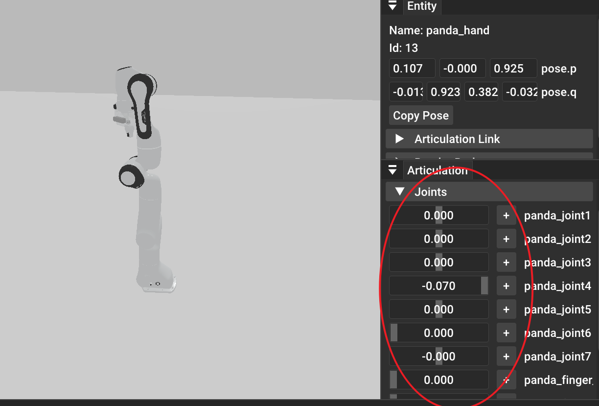

# 介绍
本仓库旨在给机器人初学者提供一个简单易用的仿真环境，以供学习。特点在于省略了ros，rviz等入门门槛较高的部分，直接使用sapien库进行仿真。

# 项目结构

核心代码已整理到 `src/` 目录下，根目录保留 `main.py`、`visualize.py`、`scale_urdf.py` 作为兼容入口。

```text
.
├── main.py                         # 兼容入口，运行 src.main
├── visualize.py                    # 兼容入口，运行 src.visualize
├── scale_urdf.py                   # 兼容入口，运行 src.scale_urdf
├── src/
│   ├── main.py                     # Panda 视觉伺服抓取主流程
│   ├── visualize.py                # 机器人可视化示例
│   ├── scale_urdf.py               # URDF mesh 缩放工具
│   ├── config/                     # 机器人、物体、相机配置
│   └── robot/                      # 场景控制、运动规划、机器人辅助模块
├── scripts/                        # 资产下载等辅助脚本
├── pic/                            # README 图片
└── asset/                          # 大体积仿真资产，本地下载使用，不纳入 Git 跟踪
```

# 安装
系统环境要求：

```bash
pip install sapien==3.0.0b1 mplib==0.2.1
```


# 下载资产

仿真所需的网格、URDF 等大文件放在仓库根目录的 `asset/` 下。若克隆本仓库后没有 `asset` 或体积不对，可从魔搭（ModelScope）数据集拉取：

- 数据集地址：[arlenkang/MIAA_SIM](https://modelscope.cn/datasets/arlenkang/MIAA_SIM)

**环境要求**：已安装 [Git LFS](https://git-lfs.com/)（`git lfs install` 一次即可）。

在项目根目录执行：

```bash
python3 scripts/download_assets_modelscope.py --namespace arlenkang --dataset MIAA_SIM --local-dir .
```

执行成功后，当前目录下会出现（或覆盖）`asset/` 目录。

**说明**：

- 默认会把远端数据集中的 `asset/` 同步到本地 `./asset/`；若本地已有 `asset/`，会被**整目录替换**，请先自行备份。
- 若数据集为私有，需使用魔搭访问令牌，例如：
  ```bash
  python3 download_assets_modelscope.py --git-token <你的token> --local-dir .
  ```

# 3D模型
模型文件位于 `asset` 目录下，使用者可以自行添加模型文件。若未随仓库带上 `asset`，请先按上文「下载资产」从魔搭获取。这里提供一个 urdf 库参考：[PartNet](https://sapien.ucsd.edu/browse)。建议使用者使用学校邮箱进行注册，可以免费下载模型。

urdf是一种机器人通用描述性文件，可以描述机器人的关节、连杆、传感器、执行器等。可以参考[urdf](https://fishros.com/d2lros2/#/humble/chapt8/get_started/1.URDF%E7%BB%9F%E4%B8%80%E6%9C%BA%E5%99%A8%E4%BA%BA%E5%BB%BA%E6%A8%A1%E8%AF%AD%E8%A8%80), 你可以试试这个生成的urdf是否可以导入到sapien中。

# 机器人
该仓库提供了三款常见的机器人模型，用户可以根据自己需要选择。使用方法如下：

```python
controller = Controller()
robot = controller.add_robot(panda_config)#panda_config需要从config中引用
```

# 运动规划
运动规划采用了[mplib](https://motion-planning-lib.readthedocs.io/latest/tutorials/getting_started.html)库。同样也可以参考[moveit](https://moveit.ai/install-moveit2/binary/)

使用者需要具备一定机器人运动学基础，详细可以参考[机器人运动学](https://fishros.com/d2lros2/#/humble/chapt6/basic/1.%E7%9F%A9%E9%98%B5%E4%B8%8E%E7%9F%A9%E9%98%B5%E8%BF%90%E7%AE%97),建议至少看完第六章内容。

代码中的Pose采用三维位置（xyz，单位为米）和四元数（wxyz，单位为弧度）表示

```python
Pose([0.4, 0.3, 0.12], [0, 1, 0, 0])
```

# 机器人示教
两种示教方式，一种是move_to_pose，一种是move_to_joints。

move_to_pose需要使用者提供目标位置和姿态，move_to_joints需要使用者提供目标关节角度。

**move_to_pose**

点击Transform按钮,然后勾选enable。点击机器人末端执行器，通过移动坐标系（分为Translate和Rotate），然后点击Teleport按钮，即可完成示教。


**move_to_joints**

点击机器人，然后在右下角的joints栏中，移动关节角度，即可完成示教。


可以通过`Copy Joint Position`按钮，复制当前关节角度。 

代码实现：

move_to_pose:
```python
mp.move_to_pose(target_pose)
```

move_to_joints:
```python
mp.move_to_joints(target_joints)
```

# 碰撞检测
这部分内容还未完善，涉及特定任务时，需要使用者自行添加。可以参考[openrave](https://github.com/rdiankov/openrave)

# （可选）MACOS用户
可以参考[ManiSkill](https://maniskill.readthedocs.io/en/latest/user_guide/getting_started/macos_install.html)来在mac上实现sapien的安装，成功部署后可在mac上显示sapien界面。由于mplib并没有对mac用户有良好的支持，所以还请同学们自行使用第三方运动规划库，如[OMPL](https://ompl.kavrakilab.org/)来完成pick&place的任务，

# 最后
该仓库还在不断完善中，欢迎使用者提出宝贵意见。
